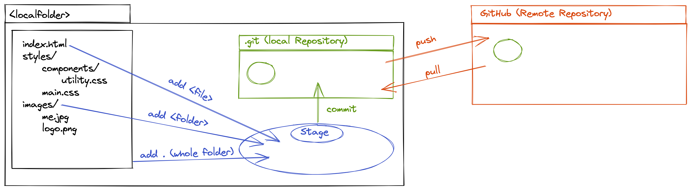

# Workflow for new projects

## Scheme Image for Example

## FIRST GIT WORKLOW

- `cd <fodlername>` : navigate to where you want to make a new folder
- `take <foldername>` : create a new folder and navigate in it (`take` is a combi of `mkdir` and `cd`)
- `mkdir <foldername>`: create new folders you need
- `touch <filename>` : create new files you need
- `touch README.md`: create a `README.md` to describe your project
- `git init` : initiate git in your first created folder, when all files and folders are created
- `touch .gitignore` : create a `.gitignore` - file
- `ls -la` : look for hidden files, you dont want to uplaod to Git / Github
- `echo '.DS_Store' >> .gitignore`: write filenames in `.gitignore`
- `git add .` : add everything to the Stage
- `git commit -m "Initial commit"` : initial commit

## FIRST GITHUB-WORKFLOW

- Add Repository on GITHUB
  - repository-name = local-folder-name
  - next Page: Quicksetup
  - choose SSH
  - copy and paste link for push in Terminal: `git remote add origin git@github.com:USERNAME/REPOSITORY.git`
    - press Enter

## SECOND GIT WORKLOW

- `git push`: push the local repository to remote

  - you will get a message like this: `git push --set-upstream origin main`
  - copy, paste, enter

- now check if the repository is on Github, by refreshing the page of the repository

- `git branch readme` : edit `README.md` and create a new branch
- `git branch` : check branch
- `git switch readme` : switch to readme-branch
- `ls -la` : check if your `README.md` is here
- `code README.md` : open and edit your `README.md` in VS Code (remember this language is Markdown)
  - save your `README.md`
- `git status`: check changes
- `git add README.md`: add `README.md` to Stage
- `git commit -m "Edit README.md"` : commit `README.md`
- `git push` : push to Github

## SECOND GITHUB-WORKFLOW

- go in to the repository
  - compare & pull request
  - leave a comment and create pull request
- **IF** your Code is reviewed and okay, than merge the pull request
  - confirm merge
  - delete branch

## THIRD GIT WORKLOW

- `git switch main` : switch to main-branch
- `git pull` : pull your Github-Repository with your local
- `git branch` : check your branches
- `git branch -d readme` : delete feature branch
- `git branch` : Check branch again

### GIT-COMMANDS

- `git init` : initialize git
- `git add .` : add all files contents to the stage
- `git add <filename>` : add specific file to the stage
- `echo ‘<filename>’ >> <destination>` : Write a file on a string
- `git commit -m “(description)”`: commit changes to git depository with a description
- `git commit --amend -m “(new_name)”` : rename last commit
- `git branch <branchename>`: add new branch
- `git switch <branchname>` : switch to specific branch
- `git branch -d <branchname>` : delete branch
- `git remote add origin <github-link>` : add github connection to local host
- `git remote` : shows repository
- `git push -u origin <branchname>` : push specific branch to github
- `git pull` : pull updates from github

#### Overview commands

- `git branch` : displays which branches exist in file
- `git status` : displays status - changes in the file, that are not up to date with git
- `git log` : displays all commits
- `git log --oneline` or `glo` : displays commits in shorter
- `git log --graph` : displays graph with all branches
